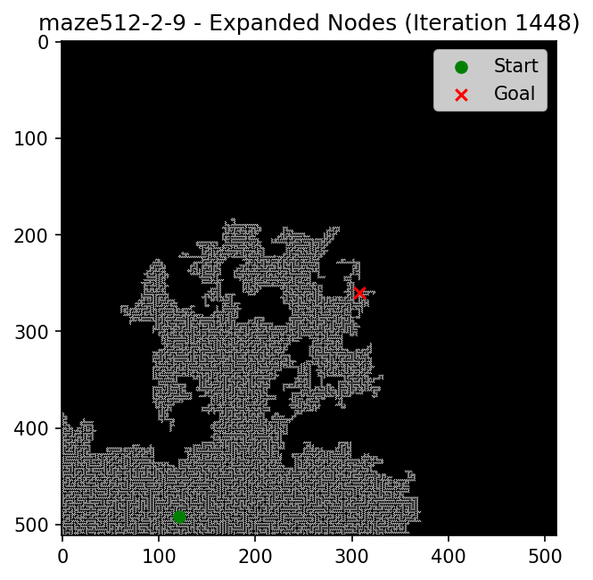
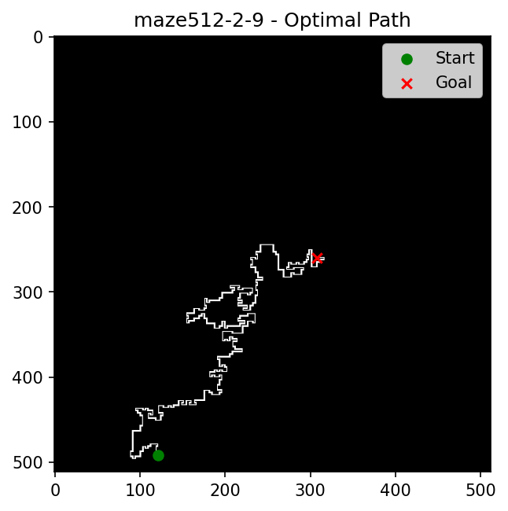
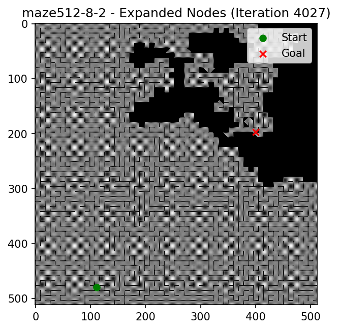
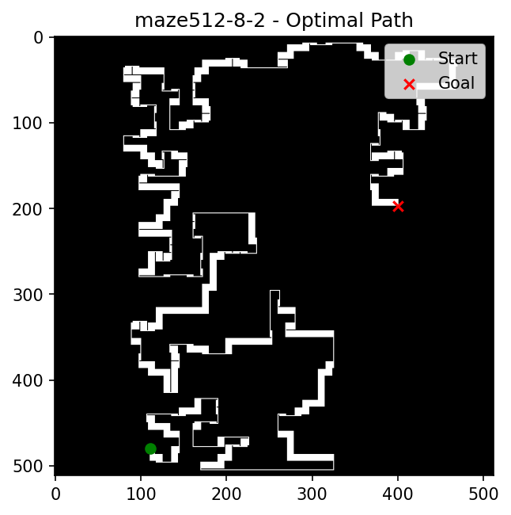
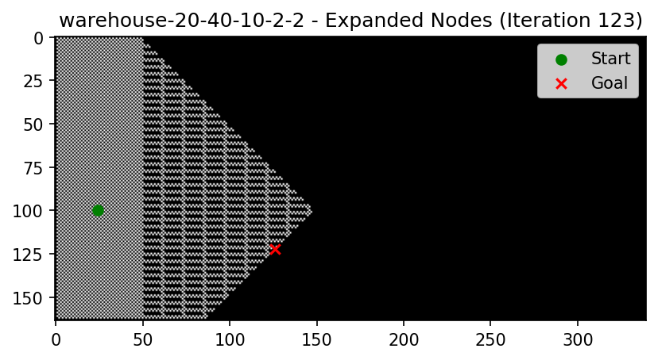
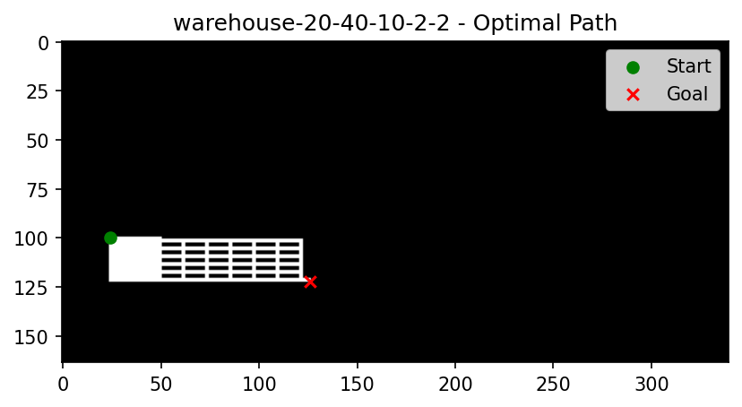

# GPU-Accelerated Neural Network Pathfinding 🚀

> **Proof of Concept:** This repository demonstrates how to use GPU acceleration to speed up single-agent pathfinding using PyTorch. This is a research prototype and I'm open to discussions about extensions, optimizations, and applications.

A novel approach to pathfinding using GPU-accelerated neural networks with convolutional activation propagation and gradient-based path tracing.

## Key Idea 💡

This implements **maximally parallelized dynamic programming**. Instead of sequentially exploring individual states (like A* or Dijkstra), the entire state space is updated simultaneously on the GPU. Each iteration propagates activation to all neighbors in parallel, making the algorithm blazingly fast.

## The Architecture 🏗️

The core is surprisingly simple - a single-layer neural network with a custom propagation kernel:

```python
class SimpleNN(nn.Module):
    def __init__(self, in_channels, out_channels, map_mask, start_xy, goal_xy, map_name):
        super().__init__()
        self.conv = nn.Conv2d(in_channels, out_channels, kernel_size=3, padding=1)
        self.relu = nn.ReLU()
        self.map_mask = map_mask
        self.map_mask_4d = map_mask.unsqueeze(0).unsqueeze(0)
        self.start_xy = start_xy
        self.goal_xy = goal_xy
        self.map_name = map_name

    def forward(self, x):
        saved_tensors = []
        goal_y, goal_x = self.goal_xy
        for i in range(int(1e6)):
            x = self.relu(self.conv(x) * self.map_mask_4d)
            x = clip_preserve_grad(x, min_val=0.0, max_val=1.0)
            x.retain_grad()
            saved_tensors.append(x)
            if x[0, 0, goal_y, goal_x] > 0:
                return x, True, saved_tensors
        return x, False, saved_tensors
```

**How it works:**
- **Conv layer**: Propagates activation to neighbors (4-connected kernel: up/down/left/right)
- **ReLU**: Only positive values propagate forward
- **Mask multiplication**: Zeros out obstacles
- **Custom gradient clipping**: Preserves gradient flow for path tracing while preventing numerical explosion
- **Iteration**: Continues until goal receives positive activation

## Results 📊

- ⏱️ **Time Complexity:** O(length of optimal path) - search time scales with solution length, not map size
- 🎯 **All Optimal Paths:** Exposes all equally optimal paths simultaneously
- 🎨 **Simple Implementation:** ~50 lines of core logic, no complex data structures
- 🔧 **No Heuristics Required:** Works out-of-the-box on unseen grids of any type
- 🗺️ **Universal:** Works with any map representable as a tensor
- ⚡ **Blazingly Fast:** Massive parallelization on GPU delivers exceptional performance

## Example Results 📸

Visual comparison of expanded nodes (exploration) vs. optimal paths (solution) on different map types:

| Map Name | Expanded Nodes | Optimal Paths |
|----------|----------------|---------------|
| **maze512-2-9**<br/>512×512 maze |  |  |
| **maze512-8-2**<br/>512×512 maze |  |  |
| **warehouse-20-40-10-2-2**<br/>Warehouse scenario |  |  |

- **Expanded Nodes:** Shows all cells explored during forward pass when goal is reached
- **Optimal Paths:** Shows the traced path(s) extracted via gradient accumulation

## Core Innovation (Implementation Details) 💡

This project implements pathfinding as a neural network forward-backward pass:

**1. Forward Pass (Activation Propagation):**
- Place activation at start position
- Iteratively apply convolution (spreads to neighbors) + ReLU
- Multiply by map mask (blocks obstacles)
- Custom gradient-preserving clipping prevents numerical explosion
- Continue until activation reaches goal

**2. Backward Pass (Path Extraction):**
- Compute gradients from goal back to start
- Gradient flow reveals the path taken by activation
- Accumulate positive gradients to extract final path

**3. GPU Acceleration:**
- All operations run on GPU (CUDA/MPS/CPU fallback)
- Handles large 3D maps efficiently (tested on 896×390×255 voxels)

## Features ✨

- 🗺️ 2D pathfinding on grid maps (.map format)
- 🧊 3D pathfinding on voxel maps (.3dmap format)
- 📊 Interactive 3D visualizations using Plotly
- ⚡ Automatic device selection (CUDA > MPS > CPU)
- 🎲 Random map selection for testing
- ⚙️ Configurable memory/quality tradeoffs

## Installation 📦

### Prerequisites
- Python 3.12+
- [uv](https://github.com/astral-sh/uv) package manager
- GPU with CUDA or Apple Silicon (MPS) for best performance

### Setup with uv (Recommended)
```bash
# Clone the repository
git clone <repository-url>
cd GPUPathfindingProject

# Install dependencies using uv
uv sync

# Activate the environment (optional, uv run handles this automatically)
source .venv/bin/activate
```

### Alternative: Setup with pip
```bash
pip install -r requirements.txt
```

### Dependencies
- `torch >= 2.11.0` (with CUDA/MPS support)
- `matplotlib >= 3.10.8`
- `plotly >= 6.6.0`
- `psutil >= 7.2.2`

## Usage 🎮

### 2D Pathfinding

**Run on a specific map:**
```bash
uv run search2D_nn.py --map maze-128-128-1.map
```

**Random map selection:**
```bash
uv run search2D_nn.py
```

**With custom seed and device:**
```bash
uv run search2D_nn.py --map warehouse-20-40-10-2-2.map --seed 8535 --device cuda
```

### 3D Pathfinding

**Run on a specific map:**
```bash
uv run search3D_nn.py --map A1.3dmap
```

**With custom settings:**
```bash
uv run search3D_nn.py --map A1.3dmap --seed 8535 --save-freq 50 --device cuda
```

> **Note:** If you've activated the virtual environment with `source .venv/bin/activate`, you can use `python` instead of `uv run`.

**Common Parameters:**
- `--map`: Map file name (from `maps/2d/` or `maps/3d/`)
- `--seed`: Random seed for reproducibility
- `--device`: Force device (`auto`/`cuda`/`mps`/`cpu`) - available for both 2D and 3D

**3D-Specific Parameters:**
- `--save-freq`: Save every Nth iteration (default: 100, lower = more memory, better path visualization)

## Project Structure 📁

```
GPUPathfindingProject/
├── maps/
│   ├── 2d/          # 2D grid maps (.map format)
│   └── 3d/          # 3D voxel maps (.3dmap format)
├── outputs/         # Generated visualizations (HTML/PNG)
├── search2D_nn.py   # 2D pathfinding script
├── search3D_nn.py   # 3D pathfinding script
├── utils.py         # 2D utilities (map loading, plotting)
├── utils3D.py       # 3D utilities (map loading, 3D visualization)
├── pyproject.toml   # uv project configuration
├── uv.lock          # uv lock file
├── requirements.txt # Pip-compatible requirements
└── README.md        # This file
```

## Map Formats 📋

### 2D Maps (.map format)
```
type octile
height 32
width 32
map
@@@@@@@@...
...
```
- `.` = walkable
- `@`, `T`, etc. = obstacles

### 3D Maps (.3dmap format)
```
voxel <width> <height> <depth>
<x> <y> <z>
...
```
- Lists occupied (obstacle) voxels
- All other voxels are walkable

## How It Works 🔬

### Custom Gradient Clipping
Standard `torch.clamp()` kills gradients at boundaries. We use a custom autograd function that clips forward values while passing gradients unchanged:

```python
class ClipWithFullGradients(torch.autograd.Function):
    @staticmethod
    def forward(ctx, input, min_val, max_val):
        return torch.clamp(input, min=min_val, max=max_val)

    @staticmethod
    def backward(ctx, grad_output):
        return grad_output, None, None  # Full gradient passthrough
```

### Connectivity Kernels
- **2D:** 4-connected (up, down, left, right)
- **3D:** 18-connected (6 faces + 12 edges, excludes 8 corners)

### Memory Optimization (3D)
For large 3D maps, saving every iteration is memory-prohibitive. We use checkpoint-based gradient accumulation:
- Save every Nth iteration (configurable via `--save-freq`)
- Detach intermediate tensors to break gradient chain
- Trade path visualization quality for memory efficiency

## Output Formats 🎨

- **2D:** PNG images with matplotlib visualization
  - `{map_name}_expanded_nodes.png` - All explored cells
  - `{map_name}_optimal_paths.png` - Traced optimal path(s)
- **3D:** Interactive HTML with Plotly (rotate, zoom, inspect voxels)
  - `{map_name}_expanded_nodes.html` - 3D exploration visualization
  - `{map_name}_optimal_paths.html` - 3D path visualization
  - `{map_name}_start_goal_preview.html` - Start/goal preview before pathfinding
- All outputs saved to `outputs/` directory

## Performance Tips 🏎️

1. **Use GPU:** CUDA or MPS dramatically speeds up computation
2. **Adjust save frequency:** Higher `--save-freq` = less memory (100-1000 for 3D)
3. **Map size:** Larger maps take longer but are fully supported
4. **Device selection:** Let `auto` choose, or force with `--device`

## Technical Details 🔧

### Algorithm Overview
1. Initialize activation tensor with 1.0 at start position
2. Apply Conv2d/Conv3d with neighbor connectivity kernel
3. Apply ReLU activation
4. Multiply by map mask to zero out obstacles
5. Apply custom gradient-preserving clip to [0, 1]
6. Check if goal position has positive activation
7. If goal reached: backward pass from goal
8. Accumulate positive gradients across saved checkpoints
9. Visualize accumulated gradients as the discovered path

### Why This Approach?
- **Differentiable:** The entire pathfinding process is differentiable
- **Parallel:** GPU acceleration for massive parallelism
- **Flexible:** Easy to modify connectivity patterns or cost functions
- **Visualizable:** Gradient flow shows exactly how activation propagated

## Limitations & Future Work 🔮

### Multi-Agent Pathfinding (MAPF)

- ✅ **Trivially extends to Prioritized Planning (PrP):** Each agent plans sequentially in a predefined order. The algorithm naturally handles this by planning one agent at a time.
- ❌ **Non-trivial for other MAPF algorithms:** Adapting to sophisticated algorithms like CBS (Conflict-Based Search) or ECBS requires significant modifications.

### 3D Case Challenges

The repository includes a 3D implementation (`search3D_nn.py`), but faces memory constraints:

- **Gradient explosion issue:** The width × height × depth × time dimensions exceed GPU memory during backward pass
- **This is a scale/optimization problem, not a theoretical limitation**
- ✅ **Forward pass works:** Can find the optimal solution length
- ❌ **Backward pass (path extraction):** Requires memory optimization techniques (checkpointing, gradient accumulation)

### Discussion Welcome

This is a proof-of-concept repository. I'm open to discussions about:
- Performance optimizations
- Memory-efficient 3D path extraction
- Extensions to MAPF algorithms
- Applications in robotics, game AI, or other domains

Feel free to open issues or reach out!

## Contributing 🤝

Contributions welcome! Areas for improvement:
- More connectivity patterns (8-connected 2D, 26-connected 3D)
- Memory-efficient backward pass for 3D
- Optimal subpath guarantees
- Benchmarking against A*/Dijkstra

## Acknowledgments 🙏

The 2D and 3D map files used in this repository are taken from the [Moving AI Lab Benchmarks](https://movingai.com/benchmarks/index.html), a comprehensive collection of pathfinding benchmark scenarios used widely in MAPF (Multi-Agent Pathfinding) research.

## License 📄

[Add license information]

## Citation 📚

If you use this code in research, please cite:
[Add citation information]

---

Built with PyTorch 🔥 | Visualized with Plotly 📊 | Accelerated by GPUs 🚀
